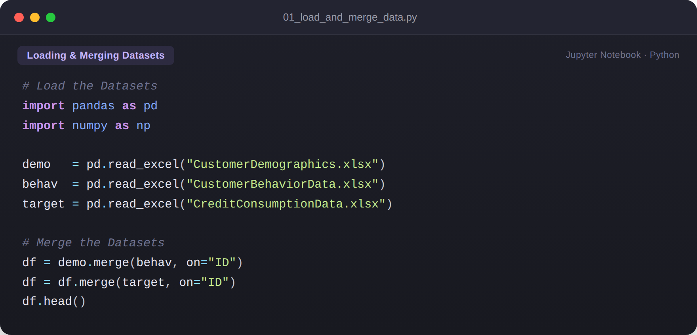
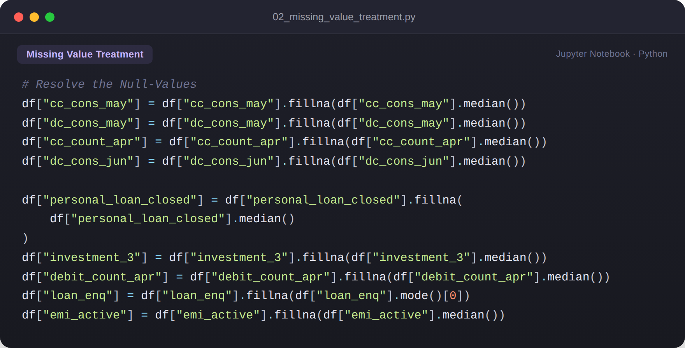
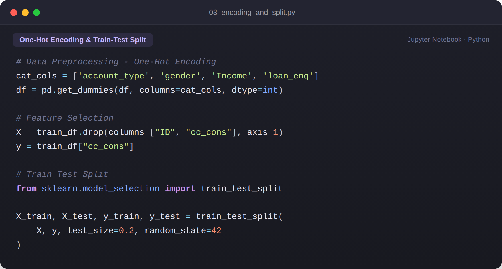
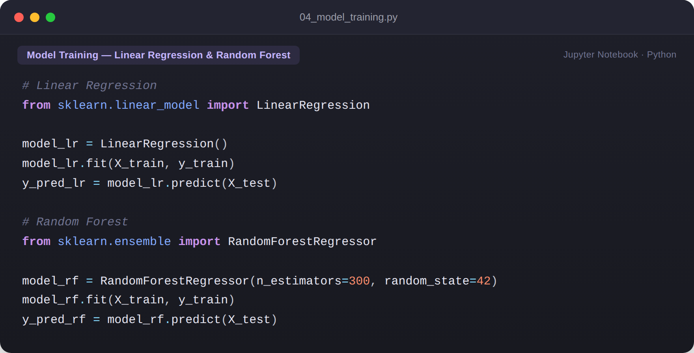
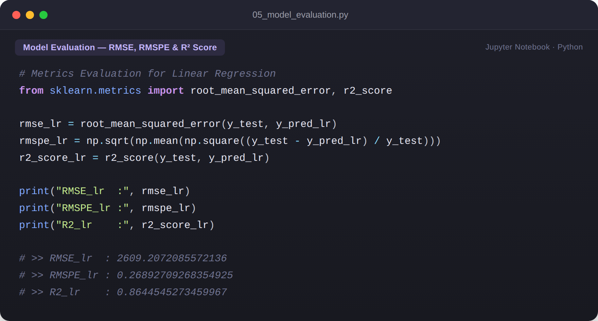
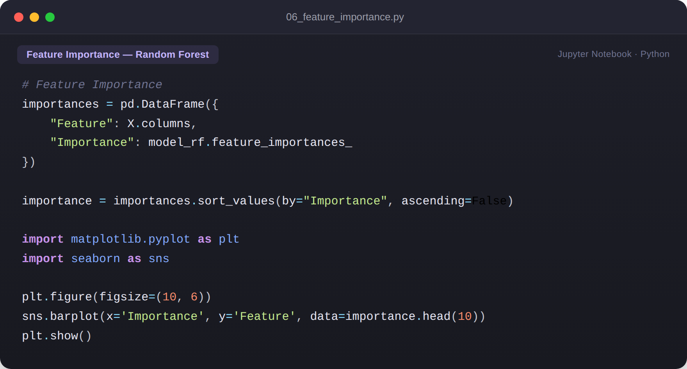
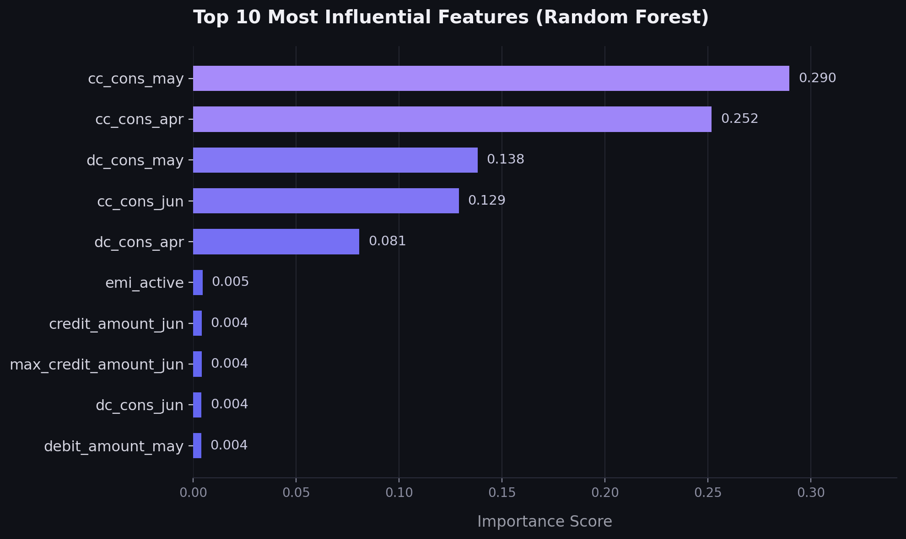
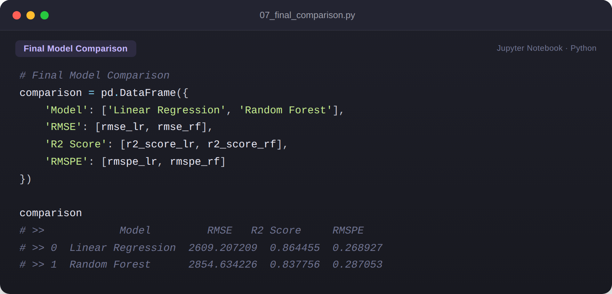
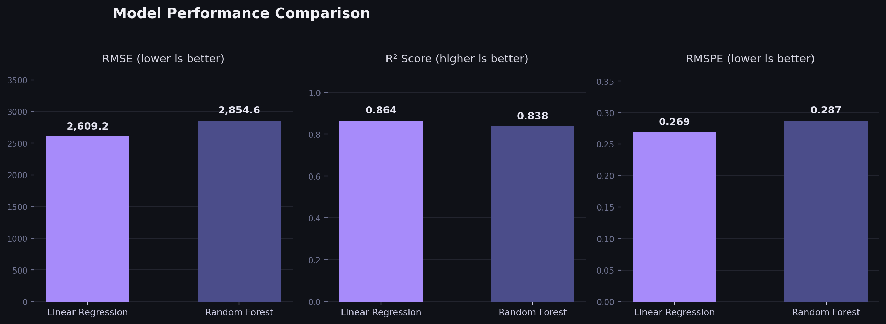

# 💳 Credit Card Consumption Prediction

## 📌 Project Overview
This project aims to predict future credit card consumption of bank customers using demographic information, transaction history, loan details, investment data, and banking behavior.

The objective is to help financial institutions identify high-value customers, improve targeted marketing campaigns, optimize credit limits, and enhance customer engagement.

---

## 🏦 Business Problem
Banks need to estimate future customer spending behavior to make informed business decisions. Accurate prediction of credit card consumption enables better customer segmentation and personalized financial offerings.

Specifically:
- Some customers have **missing values for credit consumption**.
- The model is built using customer data where credit consumption is **known**.
- The trained model is then used to **predict credit consumption for the next three months** for customers with missing values.

---

## 📊 Dataset
The project uses three datasets:
1. **Customer Demographics**
2. **Customer Behaviour Data**
3. **Credit Consumption Data**

These datasets were merged using the customer **ID** to create a unified customer profile.

---

## 🔄 Project Workflow

### 1. Data Preparation
- Dataset merging
- Missing value analysis
- Feature selection
- Data cleaning

**Loading & merging the three source datasets:**

**Treating missing values with median / mode imputation:**

### 2. Exploratory Data Analysis (EDA)
- Target distribution
- Correlation heatmap
- Outlier analysis
- Feature relationships

### 3. Data Preprocessing
- Handling categorical variables
- One-Hot Encoding
- Train-Test Split

### 4. Model Building
Models used:
- Linear Regression
- Random Forest Regressor

### 5. Model Evaluation
Evaluation Metrics:
- RMSE
- RMSPE
- R² Score

---

## 🌟 Feature Importance

The Random Forest model was used to identify which features contribute most to predicting credit card consumption. Recent transaction history (`cc_cons_may`, `cc_cons_apr`) emerged as the strongest predictors, followed by debit card consumption.

---

## 🏆 Model Performance

| Model | RMSE | R² Score | RMSPE |
|---------|---------|---------|---------|
| **Linear Regression** | **2609.21** | **0.8645** | **0.2689** |
| Random Forest | 2854.63 | 0.8378 | 0.2871 |

### ✅ Best Model
**Linear Regression** performed better across all evaluation metrics and was selected as the final model.

---

## 💡 Key Business Insights
- Credit card limit strongly influences future spending.
- Customers with higher transaction activity tend to spend more.
- Investment-related features contribute positively to spending behavior.
- Recent transaction history is a strong predictor of future consumption.

---

## 🛠️ Technologies Used
- Python
- Pandas
- NumPy
- Matplotlib
- Seaborn
- Scikit-Learn

---

## 📈 Results
The final Linear Regression model achieved:
- **R² Score:** 86.45%
- **RMSE:** 2609.21
- **RMSPE:** 26.89%

This demonstrates strong predictive performance for estimating future customer credit card consumption.

---

## 👤 Author
**Shubham Vishwakarma**
Aspiring Data Analyst | Machine Learning Enthusiast
